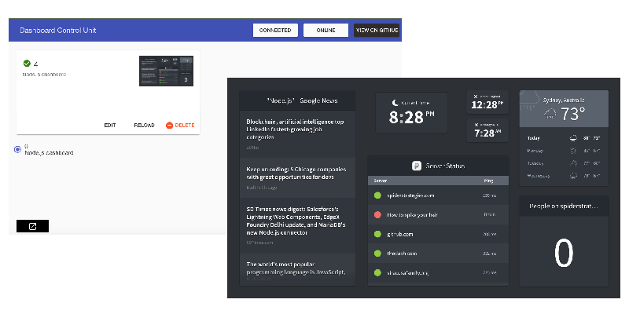
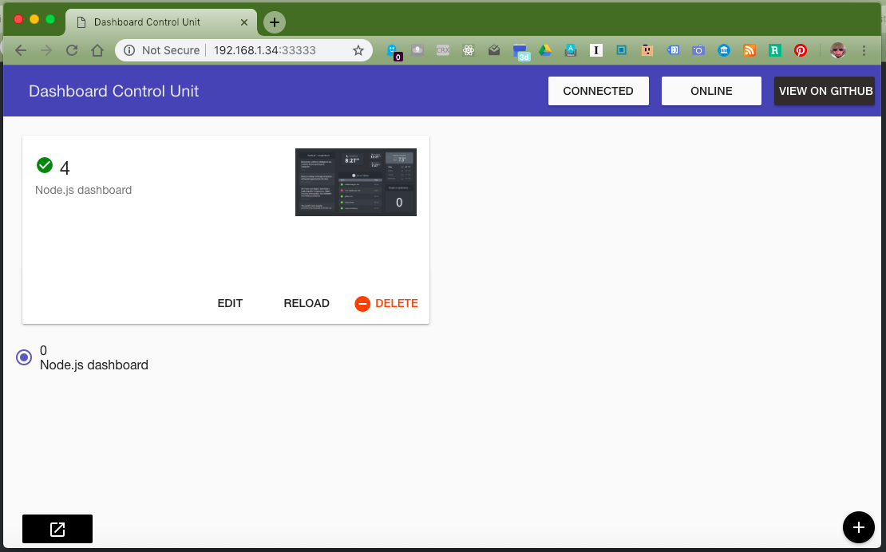

# FullPageDashboard Client v2 (0.1.1 alpha)

FullPageDashboard Client v2 is an **Electron app for full screen display of websites/dashboards**. It is built with [FullPageOS](https://github.com/guysoft/FullPageOS) as a host environment in mind, but can actually be used for any Electron-supoortive enviroment. 

This alpha version has not been integrated or tested with [FullPageOS](https://github.com/guysoft/FullPageOS) yet. [Please help test it on Raspberry Pi 3](https://github.com/tailorvj/fullpagedashboard-client/issues/1). 

FullPageDashboard Client has a built-in admin companion app that acts as a remote control. Use it to add/remove/edit URLs and push a URL to the screen. **Please note: Admin app is insecure at the moment. Use at your own risk**

## Table of Contents

1. [Roadmap](#Roadmap)
1. [Implementation](#implementation) - Installation, Usage, etc'. 
1. [Contributing](#contributing)
1. [License](#license) MIT
1. [Changelog](#Changelog)

## Roadmap

These (radical) changes are expected (but not promised) in future releases:

1. Admin dashboard - Mobile friendly and built with React instead of Angular. 
1. Admin dashboard - May be moved to the cloud for remote control, grouping and performance purposes. 
1. Player data model - Move to something a bit more standard, with playlists and timing. Player will rotate independently. 
1. Security - Implementation of login mechanism for admin dashboard. 
1. Security - Disable use of keyboard and mouse on the player machine. 
1. Multiple device management - Admin dashboard will list all devices managed by the admin. 
1. Location awareness - Each FullPageDashboard Client will have an exact location on a map. 
1. Development - This project will follow best practices for Git branching and versioning. 
1. Player - Pages will be displayed fully loaded. 

## Implementation

### Installation

1. Clone the git repository and install the node dependencies: `npm install`. Please be ensure having at least NodeJS 4.4 (actually, 4.x should be fine).
2. Start the app with `npm start`.

### Configuration and data

* The dashboard app will load and store information at `$userDir/.fullpagedashboard-client/.session.json`.
* The dashboard app will load information at `$userDir/.fullpagedashboard-client/config.json`.

The actual folder is decided in Config.js according to package.json \`name\` setting. 

#### Rules

* If the file `.session.json` is available, it will be preferred.
* The file `config.json` will be read only.
* A configuration file can contain three entries: `dashboards`, `server` and `window`.

#### Example config

```json
{
  "dashboards": {
    "active": "github-knalli",
    "items": [
      {
        "id": "github-knalli",
        "display": "GitHub knalli",
        "url": "https://github.com/knalli",
        "description": "GitHub profile of <em>knalli</em>"
      }
  ]
}
```

#### dashboard options

`active` is the current selected id of a dashboard. No value means no default, and an invalid one will be removed on startup automatically.

`items` is an array of `dashboard`.

`items[].dashboard` contains

* `id` is something unique like `github` or `dashboard1`.
* `display` is the title/display. It must not be unique, also it should be.
* `url` is the actual URL of the site. Can be any valid URL a browser/webview can display.
* `description` is an optional field only for the control app.

#### server options

`port` is the control webserver's port. Default is `33333`.

#### window options

Window is hard coded to full screen at the moment. Other window options will be added later.

### Usage

The player display should be full screen. It tells you the URL for the admin dashboard and even displays a QR code you can scan with your phone to reach it. 

Open the admin dashboard in any browser and add/remove/edit URLs in it. 

Press any URL you have defined to send it to the fullscreen display. A screenshot will be presented in the admin dashboard once it is loaded. 



[See more screenshots](site/screenshots.md)

### Current Features (from original software + fixed bugs)

*   Session data is persisted between restarts.
*   A complete "hands free" mode: after the first configuration, all configurations can be applied by the control interface remotely.
*   Sites/dashboards can be created and removed.
*   The active dashboard can be switched.
*   Simultaneous control app interface users (**note: there is currently no security applied**).
*   The control app provides live feedback between all connected control app users (new active dashboard, online status, ...).

### Dependencies

This is an Electron App. It used some non-native modules in it which may or may not run in your environment. 

#### npm modules

```javascript

    "angular": "~1.5.9",
    "angular-animate": "~1.5.9",
    "angular-aria": "~1.5.9",
    "angular-material": "~1.1.3",
    "electron": "^1.4.15",
    "eventemitter3": "^2.0.2",
    "express": "^4.14.1",
    "qrcode": "^1.3.2",
    "socket.io": "^2.2.0",
    "underscore": "^1.9.1"

```

#### engines

```javascript

    "node": "^4.7",
    "npm": "^3"

```

#### build

```javascript

    "electron-packager": "^8.5.0"

```

System should be able to **build** Electron app versions for **Windows and Linux x86** architectures at the moment. **It has not been tested.**

for a Windows x86 architecture build, use:

```console
$ npm build-windows 
```

for a Linux x86 architecture build, use:

```console
$ npm build-linux 
```

### API

None at the moment, but maybe in the future due to move to React. 


**[Back to top](#table-of-contents)**

## Screenshots

Admin dashboard and full screen display of content


Splash screen displayed full screen when no URL is set yet. 


Admin dashboard control app with a URL set in it. 



**[Back to top](#table-of-contents)**

## Contributing

**Help Needed:** [build and test on Raspberry Pi 3](https://github.com/tailorvj/fullpagedashboard-client/issues/1).

[Open an issue](https://github.com/tailorvj/fullpagedashboard-client/issues/new) to discuss potential changes/additions. Fork and send pull requests. 

Git repository is managed according to Vincent Driessen's [Git branching model](https://nvie.com/posts/a-successful-git-branching-model/)

This project uses [semantic versioning](https://semver.org/spec/v2.0.0.html). 

**[Back to top](#table-of-contents)**

## Changelog

### [0.1.0] - 2018-12-16
#### Added

*   Admin dashboard dynamic IP address and port on app/index.html (player).
*   QR code of admin dashboard URL on app/index.html (player).
*   underscore.js to server.

#### Changed

*   This Readme.md file :smile:
*   New design of player welcome page to match the FullPageOS experience. 
*   Security: Updated socket.io to the latest version to prevent potential DoS attacks.
*   Bugs: Screenshot mechanism was broken. It has been completely rebuilt. 
*   Bugs: Initial URL loading problems fixed. 
*   package.json updated to reflect current development status. 

#### Removed

*   electron-screenshot.js module - Old screenshot mechanism. 

**[Back to top](#table-of-contents)**

## License

#### Credit

This software is a fork of [electron-remote-dashboard by knalli](https://github.com/knalli/electron-remote-dashboard). 

Some rights reserved to Jan Philipp on his parts of the codebase. 

Versioning has been completely restarted because the original project did not have semantic versioning and the product roadmap aims to completely rebuild most of the solution with FullPageOS in mind.

#### (The MIT License)

Copyright (c) 2014 Bill Gooch

Permission is hereby granted, free of charge, to any person obtaining
a copy of this software and associated documentation files (the
'Software'), to deal in the Software without restriction, including
without limitation the rights to use, copy, modify, merge, publish,
        distribute, sublicense, and/or sell copies of the Software, and to
permit persons to whom the Software is furnished to do so, subject to
the following conditions:

        The above copyright notice and this permission notice shall be
included in all copies or substantial portions of the Software.

        THE SOFTWARE IS PROVIDED 'AS IS', WITHOUT WARRANTY OF ANY KIND,
        EXPRESS OR IMPLIED, INCLUDING BUT NOT LIMITED TO THE WARRANTIES OF
MERCHANTABILITY, FITNESS FOR A PARTICULAR PURPOSE AND NONINFRINGEMENT.
        IN NO EVENT SHALL THE AUTHORS OR COPYRIGHT HOLDERS BE LIABLE FOR ANY
CLAIM, DAMAGES OR OTHER LIABILITY, WHETHER IN AN ACTION OF CONTRACT,
        TORT OR OTHERWISE, ARISING FROM, OUT OF OR IN CONNECTION WITH THE
SOFTWARE OR THE USE OR OTHER DEALINGS IN THE SOFTWARE.

**[Back to top](#table-of-contents)**